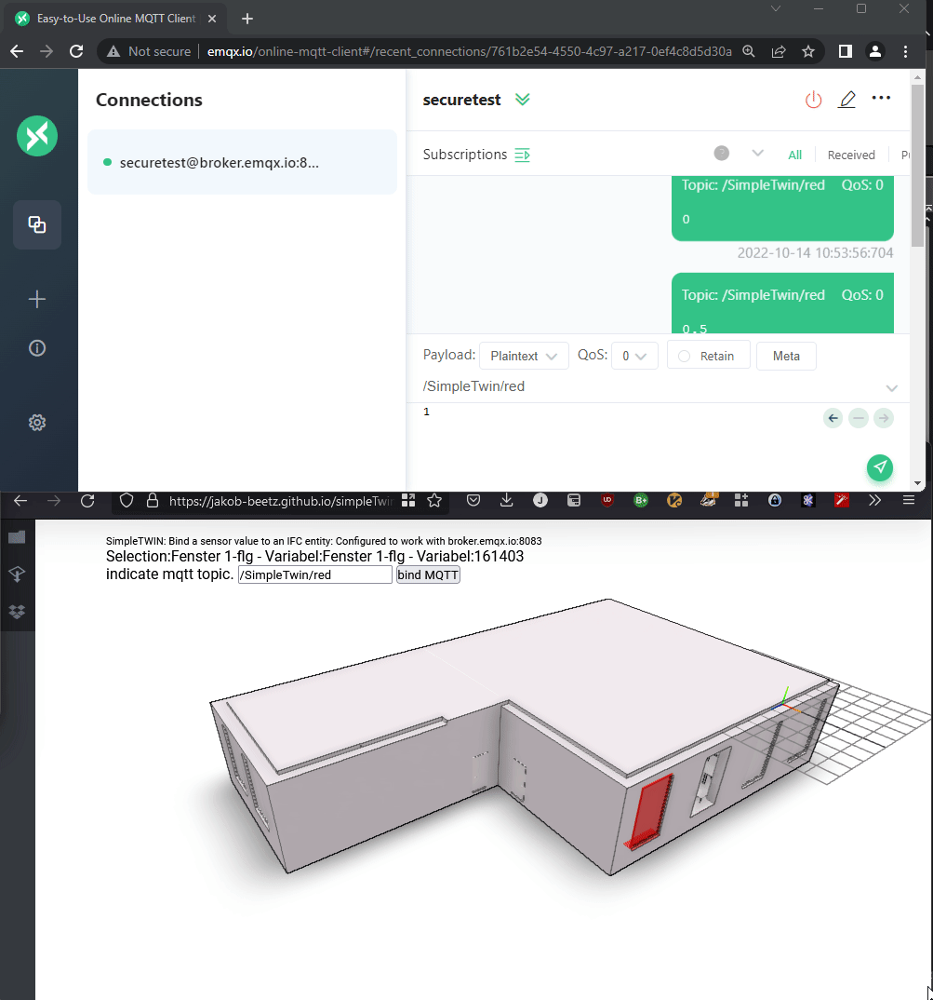

<h1>SimpleTwin</h1>

<a href="https://jakob-beetz.github.io/simpleTwin/">Live Demo</a>
 

This simple IFC viewer, based on [web-ifc-three](https://github.com/IFCjs/web-ifc-three) and [web-ifc](https://github.com/tomvandig/web-ifc) allows to hook up MTTQ Sensor to influence (the visualizaiton of) IFC BIM Models.

## Documentation

To use, 
1. load an IFC file on the left side bar (folder icon)
2. select an entity by double clicking it
3. add an MQTT topic from which to take input values. In the demonstrator, this is __a floating point number between 0.0 and 1.0__ that will then determine the red value of the selected entities RGB color.
4. Go to [the free EMQX MQTT web-interface client](http://www.emqx.io/online-mqtt-client) or similar and use the same topic on the public broker [broker.emqx.io] 

